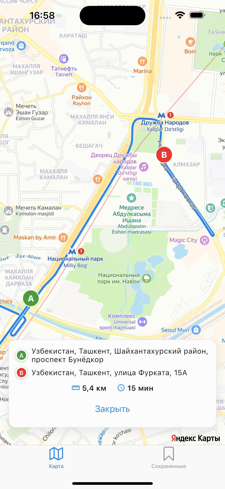
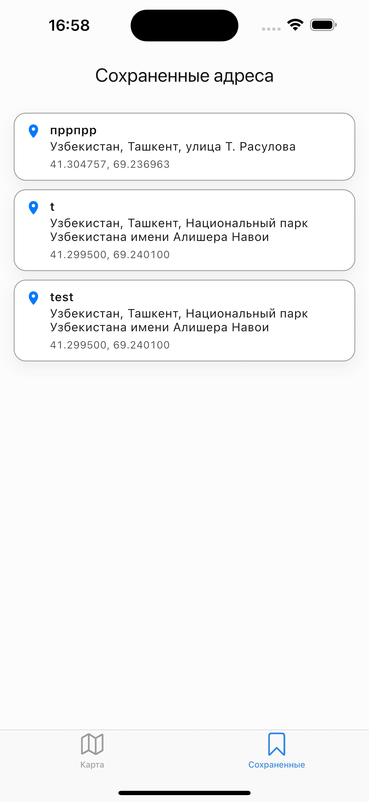
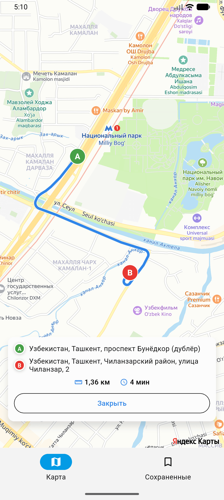
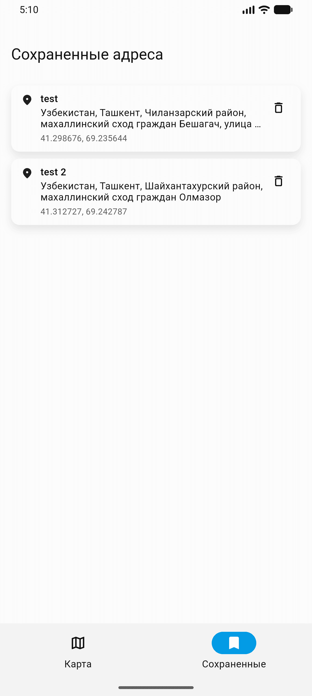

# MRCE Test App

## Скриншоты

### iOS




### Android




## Архитектура приложения

Проект организован по слоям и фичам (feature-first + Clean Architecture подход):

- `data`:
  - `freezed`-модели (DTO/модели данных);
  - репозитории и их реализации;
  - источники данных (API/локальное хранилище).
- `domain`:
  - доменные модели;
  - `interactors` (use cases) с бизнес-логикой.
- `presentation`:
  - `blocs/cubits` для управления состоянием;
  - `screens` для экранов;
  - `components` для переиспользуемых UI-частей.

Базовый принцип зависимостей: `presentation -> domain -> data`.

## Инструкция по запуску

### 1) Требования

- Flutter SDK `>=3.38.0 <3.39.0`
- Dart SDK `^3.9.2`
- Настроенные Android Studio / Xcode (в зависимости от платформы)

### 2) Установка зависимостей

```bash
flutter pub get
```

### 3) Генерация кода (Freezed/JSON и др.)

```bash
dart run build_runner build --delete-conflicting-outputs
```

### 4) Подготовка переменных окружения и ключей

Скопируйте пример и заполните значения:

```bash
cp env/.env.example env/dev.env
cp env/.env.example env/stage.env
cp env/.env.example env/prod.env
```

Приложение использует `APP_ENV_TYPE` и файлы окружения в `env/`:
- `env/dev.env`
- `env/stage.env`
- `env/prod.env`

Для карт нужно прокинуть `YANDEX_MAPKIT_API_KEY` для обеих платформ:
- **Android**: укажите ключ в `android/gradle.properties` (переменная `YANDEX_MAPKIT_API_KEY`).
- **iOS**: укажите ключ в настройках сборки Xcode (`Build Settings`/`.xcconfig`) как `YANDEX_MAPKIT_API_KEY`, он используется в `ios/Runner/Info.plist`.

### 5) Запуск приложения

Запуск для `dev`:

```bash
flutter run --dart-define=APP_ENV_TYPE=dev
```
